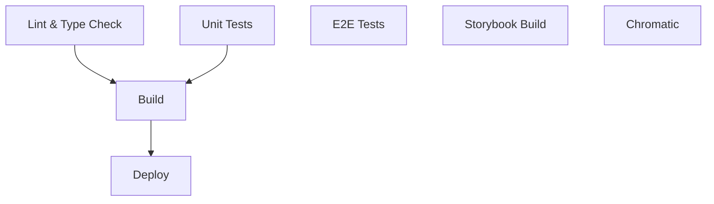

# CI/CD Pipeline Documentation

## Overview

This project uses GitHub Actions for continuous integration and deployment. The CI/CD pipeline ensures code quality, runs tests, and deploys the application automatically.

## Pipeline Architecture

### Workflows

#### 1. CI/CD Pipeline (`.github/workflows/ci.yml`)

Runs on every push and pull request to `main` and `develop` branches.

**Jobs:**

- **Lint & Type Check**
  - Runs ESLint to check code quality
  - Performs TypeScript type checking
  - Fails fast if code doesn't meet standards

- **Unit Tests**
  - Runs Vitest unit tests
  - Generates coverage reports
  - Uploads coverage to Codecov
  - Enforces 80% coverage threshold

- **E2E Tests**
  - Runs Playwright tests across multiple browsers
  - Tests in Chromium, Firefox (matrix strategy)
  - Uploads test reports as artifacts
  - Captures screenshots/videos on failure

- **Build Application**
  - Builds production bundle
  - Verifies build succeeds
  - Uploads dist artifacts

- **Build Storybook**
  - Builds Storybook documentation
  - Uploads static files

#### 2. Deploy Storybook (`.github/workflows/deploy.yml`)

Runs on push to `main` branch.

**Steps:**
- Builds Storybook
- Deploys to GitHub Pages
- Available at: `https://[username].github.io/[repo]/`

#### 3. Chromatic Visual Tests (`.github/workflows/chromatic.yml`)

Runs on push and pull requests.

**Steps:**
- Publishes Storybook to Chromatic
- Performs visual regression testing
- Requires `CHROMATIC_PROJECT_TOKEN` secret

## Environment Variables & Secrets

### Required Secrets

Configure these in GitHub repository settings under `Settings > Secrets and variables > Actions`:

| Secret | Description | Required For |
|--------|-------------|--------------|
| `VITE_SUPABASE_URL` | Supabase project URL | Build, E2E tests |
| `VITE_SUPABASE_ANON_KEY` | Supabase anonymous key | Build, E2E tests |
| `CODECOV_TOKEN` | Codecov upload token | Coverage reporting |
| `CHROMATIC_PROJECT_TOKEN` | Chromatic project token | Visual regression |

### Environment Variables

Set in workflow files:
- `NODE_VERSION`: Node.js version (currently 20)

## Job Dependencies



## Test Coverage Requirements

- **Overall Coverage**: 80% minimum
- **Per File**: 70% minimum
- **Functions**: 80% minimum
- **Branches**: 75% minimum

Coverage is enforced in `vitest.config.ts`.

## Viewing Test Results

### Unit Test Results

Coverage reports are uploaded to Codecov and displayed on pull requests.

View detailed reports:
1. Click on the Codecov comment in your PR
2. Navigate to the Codecov dashboard
3. Review file-by-file coverage

### E2E Test Results

Playwright generates HTML reports uploaded as artifacts.

To view:
1. Go to Actions tab in GitHub
2. Click on the workflow run
3. Download `playwright-report-{browser}` artifact
4. Extract and open `index.html`

### Visual Test Results

Chromatic results are posted as PR comments.

To review:
1. Click the Chromatic link in PR
2. Review visual changes
3. Accept or reject changes

## Local Development

### Running CI Checks Locally

```bash
# Lint
npm run lint

# Type check
npx tsc --noEmit

# Unit tests with coverage
npm run test:coverage

# E2E tests
npm run test:e2e

# Build
npm run build

# Storybook
npm run build-storybook
```

### Running Specific Jobs

```bash
# Run only E2E tests for chromium
npx playwright test --project=chromium

# Run unit tests in watch mode
npm run test:watch

# Run E2E tests with UI
npm run test:e2e:ui
```

## Deployment Process

### Automatic Deployment

1. **Merge to Main**
   - Triggers CI pipeline
   - All tests must pass
   - Build must succeed

2. **Storybook Deployment**
   - Automatically deploys to GitHub Pages
   - Available within 5 minutes
   - URL: `https://[username].github.io/[repo]/`

### Manual Deployment

Trigger manual deployment:
1. Go to Actions tab
2. Select "Deploy Storybook" workflow
3. Click "Run workflow"
4. Select branch and run

## Monitoring & Alerts

### Build Status

Monitor build status via:
- GitHub Actions tab
- Status badges in README
- Email notifications (configured in GitHub settings)

### Coverage Trends

View coverage trends:
- Codecov dashboard
- Coverage graphs
- Historical comparison

### Performance Metrics

Track:
- Build time (target: <10 minutes)
- Test execution time
- Bundle size (via GitHub Actions artifacts)

## Troubleshooting

### Common Issues

#### 1. E2E Tests Failing

**Symptoms**: Playwright tests timeout or fail randomly

**Solutions**:
- Check if test is flaky (retry in CI)
- Review screenshots/videos in artifacts
- Run locally: `npm run test:e2e:debug`

#### 2. Coverage Below Threshold

**Symptoms**: Build fails with "Coverage threshold not met"

**Solutions**:
- Add tests for uncovered code
- Review coverage report
- Run: `npm run test:coverage -- --reporter=html`

#### 3. Build Failures

**Symptoms**: TypeScript errors or build fails

**Solutions**:
- Run `npx tsc --noEmit` locally
- Fix TypeScript errors
- Ensure all dependencies installed

#### 4. Visual Regression Changes

**Symptoms**: Chromatic shows unexpected changes

**Solutions**:
- Review changes in Chromatic UI
- Accept intentional changes
- Fix unintentional changes
- Update components

### Debug Commands

```bash
# Debug E2E test
npx playwright test --debug

# View E2E test report
npx playwright show-report

# Debug unit test
npm run test:ui

# Check build output
npm run build -- --debug
```

## Best Practices

### Writing CI-Friendly Tests

1. **E2E Tests**
   - Use stable selectors (data-testid)
   - Add proper waits
   - Handle dynamic content
   - Mock time-dependent functions

2. **Unit Tests**
   - Keep tests isolated
   - Use test fixtures
   - Mock external dependencies
   - Test edge cases

3. **Visual Tests**
   - Mask dynamic content
   - Disable animations
   - Use consistent data
   - Test multiple viewports

### Optimizing Build Time

1. **Caching**
   - npm cache enabled by default
   - Playwright browsers cached

2. **Parallelization**
   - E2E tests run in parallel
   - Matrix strategy for browsers

3. **Conditional Execution**
   - Skip E2E on draft PRs
   - Run visual tests only on affected stories

## Performance Targets

| Metric | Target | Current |
|--------|--------|---------|
| Total CI time | <10 min | ~8 min |
| Unit tests | <2 min | ~1 min |
| E2E tests | <5 min | ~4 min |
| Build | <3 min | ~2 min |

## Rollback Procedures

### Reverting a Deployment

1. **Identify problematic commit**
   ```bash
   git log --oneline
   ```

2. **Revert commit**
   ```bash
   git revert <commit-hash>
   git push origin main
   ```

3. **Verify**
   - Check Actions tab
   - Wait for deployment
   - Test production site

### Emergency Rollback

If immediate rollback needed:

1. Go to previous successful deployment
2. Re-run workflow
3. Monitor deployment status

## Security

### Secret Management

- Never commit secrets
- Rotate secrets regularly
- Use GitHub Secrets (encrypted)
- Audit secret access

### Dependency Security

- npm audit runs in CI
- Snyk scans for vulnerabilities
- Dependabot updates dependencies
- Review security advisories

## Contributing

When adding CI/CD changes:

1. Test workflows in feature branch
2. Document new jobs/steps
3. Update this documentation
4. Ensure backwards compatibility
5. Monitor first runs after merge

## Resources

- [GitHub Actions Documentation](https://docs.github.com/en/actions)
- [Playwright CI Documentation](https://playwright.dev/docs/ci)
- [Chromatic Documentation](https://www.chromatic.com/docs)
- [Codecov Documentation](https://docs.codecov.com)
