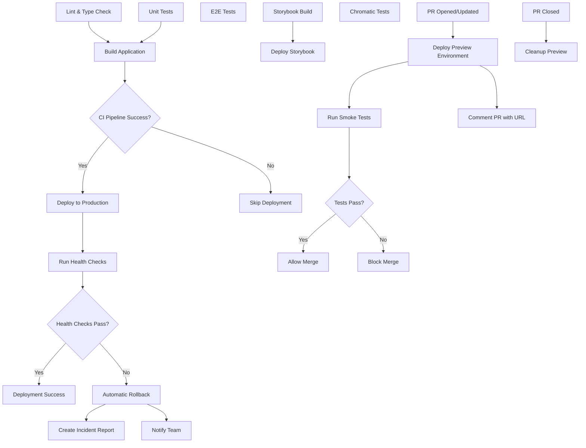

# CI/CD Pipeline Documentation

## Overview

This project uses GitHub Actions for continuous integration and deployment. The CI/CD pipeline ensures code quality, runs tests, and deploys the application automatically.

**Related Documentation:**
- [Testing Guide](./TESTING.md) - Unit, integration, and E2E testing
- [Smoke Tests Guide](./SMOKE-TESTS.md) - Preview environment quality gates
- [Architecture Guide](./ARCHITECTURE.md) - Application architecture

## Pipeline Architecture

### Workflows

#### 1. CI/CD Pipeline (`.github/workflows/ci.yml`)

Runs on every push and pull request to `main` and `develop` branches.

**Jobs:**

- **Lint & Type Check**
  - Runs ESLint to check code quality
  - Performs TypeScript type checking
  - Fails fast if code doesn't meet standards

- **Unit Tests**
  - Runs Vitest unit tests
  - Generates coverage reports
  - Uploads coverage to Codecov
  - Enforces 80% coverage threshold

- **E2E Tests**
  - Runs Playwright tests across multiple browsers
  - Tests in Chromium, Firefox (matrix strategy)
  - Uploads test reports as artifacts
  - Captures screenshots/videos on failure

- **Build Application**
  - Builds production bundle
  - Verifies build succeeds
  - Uploads dist artifacts

- **Build Storybook**
  - Builds Storybook documentation
  - Uploads static files

#### 2. Preview Environment (`.github/workflows/deploy-preview.yml`)

Runs on pull requests to `main` and `develop` branches.

**Trigger:**
- PR opened, synchronized, or reopened
- PR closed (for cleanup)

**Features:**
- Deploys each PR to unique preview URL
- Comments on PR with preview link
- Automatic cleanup when PR closes
- Branch-specific environments
- Triggers smoke tests automatically

**Preview URL Format:**
`https://[username].github.io/[repo]/preview/pr-[number]/`

#### 3. Preview Smoke Tests (`.github/workflows/preview-smoke-tests.yml`)

Runs automatically after preview deployment completes.

**Trigger:**
- Workflow dependency on "Deploy Preview Environment"
- Only runs on successful preview deployments

**Tests Performed:**
- Preview environment loads successfully
- No critical console errors
- Authentication page is accessible
- Main application elements render
- No network errors for critical resources

**Features:**
- Creates check run that blocks PR merge on failure
- Comments on PR with test results
- Uploads detailed test artifacts
- Requires all tests to pass before merge

**Merge Requirements:**
PRs cannot be merged until smoke tests pass. This ensures:
- Preview environment is functional
- No critical errors introduced
- Core functionality works as expected

📖 **[View Smoke Tests Guide](./SMOKE-TESTS.md)** for detailed information on running, debugging, and extending smoke tests.

#### 4. Production Deployment (`.github/workflows/deploy-production.yml`)

Runs automatically when CI pipeline passes on `main` branch.

**Trigger:**
- Workflow dependency on CI Pipeline
- Only deploys if all tests pass
- Skips deployment if CI fails

**Steps:**
- Builds production application
- Deploys to GitHub Pages
- Creates deployment summary
- Notifies on CI failure

**Features:**
- Automated deployment on successful CI
- Production environment protection
- Deployment URL in workflow summary
- Failure notifications

#### 5. Production Health Check & Rollback (`.github/workflows/production-health-check.yml`)

Runs automatically after production deployment completes.

**Trigger:**
- Workflow dependency on "Deploy to Production"
- Only runs after successful deployment
- Monitors production health continuously

**Health Checks Performed:**
- HTTP status code verification (200 OK)
- Response time monitoring (<5s threshold)
- Content validation (valid HTML)
- Critical resource availability
- Console error detection

**Automatic Rollback:**
- Triggers if any critical health check fails
- Automatically reverts to previous stable commit
- Rebuilds and redeploys previous version
- Creates incident report in GitHub Issues
- Notifies team of rollback action

**Incident Management:**
- Creates detailed incident report as GitHub Issue
- Labels: `incident`, `production`, `auto-rollback`
- Includes failure details and workflow links
- Tracks rollback status and next steps
- Provides complete audit trail

**Notifications:**
- GitHub Issue notifications
- Workflow status updates
- Repository activity feed
- Optional: Slack/Email webhooks (configure in secrets)

**Features:**
- Zero-downtime rollback capability
- Automatic incident logging
- Team notification system
- Comprehensive health monitoring
- Detailed failure diagnostics

#### 6. Deploy Storybook (`.github/workflows/deploy.yml`)

Runs on push to `main` branch.

**Steps:**
- Builds Storybook
- Deploys to GitHub Pages
- Available at: `https://[username].github.io/[repo]/`

#### 7. Chromatic Visual Tests (`.github/workflows/chromatic.yml`)

Runs on push and pull requests.

**Steps:**
- Publishes Storybook to Chromatic
- Performs visual regression testing
- Requires `CHROMATIC_PROJECT_TOKEN` secret

## Environment Variables & Secrets

### Required Secrets

Configure these in GitHub repository settings under `Settings > Secrets and variables > Actions`:

| Secret | Description | Required For |
|--------|-------------|--------------|
| `VITE_SUPABASE_URL` | Supabase project URL | Build, E2E tests, Production deployment |
| `VITE_SUPABASE_ANON_KEY` | Supabase anonymous key | Build, E2E tests, Production deployment |
| `SUPABASE_URL` | Supabase project URL | Security tests |
| `SUPABASE_ANON_KEY` | Supabase anonymous key | Security tests |
| `SUPABASE_SERVICE_ROLE_KEY` | Supabase service role key | Security tests |
| `CODECOV_TOKEN` | Codecov upload token | Coverage reporting |
| `CHROMATIC_PROJECT_TOKEN` | Chromatic project token | Visual regression |

### Environment Variables

Set in workflow files:
- `NODE_VERSION`: Node.js version (currently 20)

## Job Dependencies



## Test Coverage Requirements

- **Overall Coverage**: 80% minimum
- **Per File**: 70% minimum
- **Functions**: 80% minimum
- **Branches**: 75% minimum

Coverage is enforced in `vitest.config.ts`.

## Viewing Test Results

### Unit Test Results

Coverage reports are uploaded to Codecov and displayed on pull requests.

View detailed reports:
1. Click on the Codecov comment in your PR
2. Navigate to the Codecov dashboard
3. Review file-by-file coverage

### E2E Test Results

Playwright generates HTML reports uploaded as artifacts.

To view:
1. Go to Actions tab in GitHub
2. Click on the workflow run
3. Download `playwright-report-{browser}` artifact
4. Extract and open `index.html`

### Visual Test Results

Chromatic results are posted as PR comments.

To review:
1. Click the Chromatic link in PR
2. Review visual changes
3. Accept or reject changes

## Local Development

### Running CI Checks Locally

```bash
# Lint
npm run lint

# Type check
npx tsc --noEmit

# Unit tests with coverage
npm run test:coverage

# E2E tests
npm run test:e2e

# Build
npm run build

# Storybook
npm run build-storybook
```

### Running Specific Jobs

```bash
# Run only E2E tests for chromium
npx playwright test --project=chromium

# Run unit tests in watch mode
npm run test:watch

# Run E2E tests with UI
npm run test:e2e:ui
```

## Deployment Process

### Preview Environments (Feature Branch Testing)

Every pull request automatically gets its own preview environment with automated quality checks:

1. **Automatic Preview Creation**
   - Triggered when PR is opened or updated
   - Builds the feature branch code
   - Deploys to unique preview URL: `https://[username].github.io/[repo]/preview/pr-[number]/`
   - Posts preview URL as a PR comment

2. **Automated Smoke Tests**
   - Run automatically after preview deployment
   - Verify critical functionality:
     - Preview environment loads
     - No critical console errors
     - Authentication page accessible
     - Main application renders correctly
     - No network errors for critical resources
   - **Block PR merge if tests fail**
   - Post results as PR comment and check run

3. **Testing Your Changes**
   - Click the preview URL in the PR comment
   - Test the feature in an isolated environment
   - Share the URL with teammates for review
   - Each PR update refreshes preview and re-runs smoke tests
   - Check smoke test results before requesting review

4. **Merge Requirements**
   - All smoke tests must pass
   - Check run status displayed in PR
   - Cannot merge until tests succeed
   - Ensures quality before production deployment

5. **Automatic Cleanup**
   - Preview is automatically removed when PR is closed/merged
   - No manual cleanup needed
   - Keeps gh-pages branch clean

**Benefits:**
- Test features before merging to main
- Automated quality checks prevent broken deployments
- Share working demos with stakeholders
- Catch critical issues early
- No impact on production environment
- Enforced quality gates

### Automatic Production Deployment with Health Checks

The production application deploys automatically when all tests pass on the `main` branch, with automatic health monitoring and rollback:

1. **CI Pipeline Completes**
   - All lint, type checks, unit tests, and E2E tests pass
   - Application build succeeds

2. **Production Deployment Triggers**
   - Automatically starts when CI workflow succeeds
   - Builds production bundle with environment variables
   - Deploys to GitHub Pages production environment
   - Creates deployment summary with URL

3. **Automatic Health Checks**
   - Runs immediately after deployment completes
   - Verifies:
     - HTTP 200 status code
     - Response time under 5 seconds
     - Valid HTML content
     - Critical resources available
     - No obvious console errors
   - Results posted to workflow summary

4. **Automatic Rollback (if health checks fail)**
   - Detects failed health checks instantly
   - Finds previous stable commit
   - Rebuilds and redeploys previous version
   - Creates incident report in GitHub Issues
   - Notifies team automatically
   - Provides complete audit trail

5. **Incident Management**
   - GitHub Issue created with label: `incident`, `production`, `auto-rollback`
   - Includes:
     - Timestamp and severity
     - Failed commit details
     - Health check failure reasons
     - Rollback status
     - Links to workflow runs
     - Next steps for resolution
   - Team notified via GitHub notifications

6. **Deployment Verification**
   - Check Actions tab for deployment and health check status
   - Review deployment summary for production URL
   - Monitor incident issues for any failures
   - Verify application is live and healthy

**Safety Features:**
- Zero-downtime rollback
- Automatic incident creation
- Complete failure diagnostics
- Team notification system
- Full audit trail in GitHub Issues

**Note:** If CI fails, production deployment is automatically skipped. If deployment succeeds but health checks fail, automatic rollback ensures production stability.

### Storybook Deployment

Storybook deploys independently on every push to `main`:

1. **Automatic Deploy**
   - Builds Storybook documentation
   - Deploys to GitHub Pages
   - Available within 5 minutes
   - URL: `https://[username].github.io/[repo]/`

### Manual Deployment

Trigger manual deployments when needed:

1. **Production Deployment**
   - Go to Actions tab
   - Select "Deploy to Production" workflow
   - Click "Run workflow"
   - Note: Manual runs bypass CI checks

2. **Storybook Deployment**
   - Go to Actions tab
   - Select "Deploy Storybook" workflow
   - Click "Run workflow"
   - Select branch and run

## Monitoring & Alerts

### Preview Environments

View and manage preview deployments:

**Finding Preview URLs:**
- Check PR comments for preview links
- View in Actions tab under "Deploy Preview Environment"
- Access via workflow summary

**Managing Previews:**
- Previews update automatically on new commits
- Smoke tests run automatically after each preview deployment
- Manual cleanup: Close/merge the PR
- Check active previews: Browse gh-pages branch `/preview/` directory
- Preview URLs follow format: `https://[username].github.io/[repo]/preview/pr-[number]/`

**Smoke Test Results:**
- View results in PR comments
- Check "Preview Smoke Tests" status in PR checks
- Download detailed test artifacts from Actions tab
- Tests must pass before PR can be merged
- Re-run tests by pushing new commits

**Troubleshooting Previews:**
- **Preview doesn't update**: Check workflow status in Actions tab
- **URL returns 404**: Wait 2-3 minutes for GitHub Pages to update
- **Build fails**: Review workflow logs for errors
- **Smoke tests fail**: Check test results in PR comment and workflow artifacts
- **Tests timeout**: Preview may not be fully deployed, wait and re-run
- **False positive failures**: Review test artifacts, may need to adjust smoke tests

### Build Status

Monitor build status via:
- GitHub Actions tab
- Status badges in README
- Email notifications (configured in GitHub settings)

### Coverage Trends

View coverage trends:
- Codecov dashboard
- Coverage graphs
- Historical comparison

### Performance Metrics

Track:
- Build time (target: <10 minutes)
- Test execution time
- Bundle size (via GitHub Actions artifacts)

## Troubleshooting

### Common Issues

#### 1. E2E Tests Failing

**Symptoms**: Playwright tests timeout or fail randomly

**Solutions**:
- Check if test is flaky (retry in CI)
- Review screenshots/videos in artifacts
- Run locally: `npm run test:e2e:debug`

#### 2. Coverage Below Threshold

**Symptoms**: Build fails with "Coverage threshold not met"

**Solutions**:
- Add tests for uncovered code
- Review coverage report
- Run: `npm run test:coverage -- --reporter=html`

#### 3. Build Failures

**Symptoms**: TypeScript errors or build fails

**Solutions**:
- Run `npx tsc --noEmit` locally
- Fix TypeScript errors
- Ensure all dependencies installed

#### 4. Visual Regression Changes

**Symptoms**: Chromatic shows unexpected changes

**Solutions**:
- Review changes in Chromatic UI
- Accept intentional changes
- Fix unintentional changes
- Update components

#### 5. Preview Deployment Issues

**Symptoms**: Preview environment not accessible or outdated

**Solutions**:
- **404 Error**: Wait 2-3 minutes for GitHub Pages CDN to update
- **Stale Preview**: Check workflow logs - may need to re-trigger
- **Build Failed**: Review "Deploy Preview Environment" workflow logs
- **Missing Comment**: Check PR permissions and GitHub Actions token
- **Wrong Content**: Verify correct branch is being deployed
- Clear browser cache and try again

**Manual Cleanup**:
```bash
# If preview isn't auto-cleaned
git checkout gh-pages
git rm -rf preview/pr-[number]
git commit -m "Manual cleanup of preview"
git push origin gh-pages
```

#### 6. Smoke Tests Failing

**Symptoms**: PR blocked due to failed smoke tests

**Solutions**:
- **Preview loads failed**: Verify preview URL is accessible in browser
- **Console errors**: Check browser console for JavaScript errors
- **Auth page not found**: Ensure `/auth` route exists and renders
- **Network errors**: Check that all API calls and resources load correctly
- **Tests timeout**: Preview may still be deploying, wait 30 seconds and re-run

**Debugging Smoke Tests**:
```bash
# Run smoke tests locally against preview
PREVIEW_URL="https://[username].github.io/[repo]/preview/pr-[number]/" npx playwright test smoke-test.spec.ts

# View detailed test results
npx playwright show-report
```

**Bypassing Smoke Tests** (Not Recommended):
- Smoke tests are required checks - they cannot be bypassed without admin permissions
- Fix the underlying issues instead of bypassing tests
- If tests are incorrectly failing, update the smoke test criteria

### Debug Commands

```bash
# Debug E2E test
npx playwright test --debug

# View E2E test report
npx playwright show-report

# Debug unit test
npm run test:ui

# Check build output
npm run build -- --debug

# Run smoke tests locally
PREVIEW_URL="https://[username].github.io/[repo]/preview/pr-[number]/" npx playwright test smoke-test.spec.ts
```

## Required Status Checks Configuration

To enforce smoke tests before allowing PR merges, configure branch protection rules:

### Setting Up Required Checks

1. **Navigate to Repository Settings**
   - Go to Settings → Branches
   - Click "Add rule" or edit existing rule for `main` branch

2. **Configure Protection Rules**
   - Check "Require status checks to pass before merging"
   - Check "Require branches to be up to date before merging"
   
3. **Select Required Checks**
   - Search and select: "Preview Smoke Tests"
   - Search and select: "CI Pipeline" jobs:
     - `lint`
     - `unit-tests`
     - `e2e-tests`
     - `build`

4. **Additional Recommended Settings**
   - Check "Require a pull request before merging"
   - Set "Required approvals" to 1 or more
   - Check "Dismiss stale pull request approvals"

### What This Enforces

With these rules enabled:
- ✅ PRs cannot be merged if smoke tests fail
- ✅ All CI checks must pass
- ✅ Preview environment must be functional
- ✅ Code must be reviewed before merging
- ✅ Protection against broken deployments

### Overriding Checks (Admin Only)

Repository admins can bypass checks when necessary:
- Use only for critical hotfixes
- Document reason in PR description
- Fix underlying issues immediately after merge

## Best Practices

### Writing CI-Friendly Tests

1. **E2E Tests**
   - Use stable selectors (data-testid)
   - Add proper waits
   - Handle dynamic content
   - Mock time-dependent functions

2. **Unit Tests**
   - Keep tests isolated
   - Use test fixtures
   - Mock external dependencies
   - Test edge cases

3. **Visual Tests**
   - Mask dynamic content
   - Disable animations
   - Use consistent data
   - Test multiple viewports

### Optimizing Build Time

1. **Caching**
   - npm cache enabled by default
   - Playwright browsers cached

2. **Parallelization**
   - E2E tests run in parallel
   - Matrix strategy for browsers

3. **Conditional Execution**
   - Skip E2E on draft PRs
   - Run visual tests only on affected stories

## Performance Targets

| Metric | Target | Current |
|--------|--------|---------|
| Total CI time | <10 min | ~8 min |
| Unit tests | <2 min | ~1 min |
| E2E tests | <5 min | ~4 min |
| Build | <3 min | ~2 min |

## Rollback Procedures

### Automatic Rollback (Recommended)

Production deployments include automatic health monitoring with instant rollback:

1. **Automatic Detection**
   - Health checks run after every production deployment
   - Failures trigger automatic rollback
   - No manual intervention required

2. **What Gets Rolled Back Automatically**
   - Failed HTTP status checks
   - Slow response times (>5s)
   - Invalid HTML content
   - Missing critical resources
   - Console errors

3. **Incident Response**
   - GitHub Issue created automatically with `incident` label
   - Team notified via GitHub notifications
   - Complete failure details in workflow logs
   - Previous stable version restored instantly

4. **After Automatic Rollback**
   - Review the incident issue created
   - Check workflow logs for failure details
   - Fix issues in a new branch
   - Test thoroughly before merging

### Manual Rollback

For situations requiring manual intervention:

1. **Identify problematic commit**
   ```bash
   git log --oneline
   ```

2. **Revert commit**
   ```bash
   git revert <commit-hash>
   git push origin main
   ```

3. **Verify**
   - Check Actions tab
   - Wait for deployment
   - Monitor health checks
   - Test production site

### Emergency Manual Rollback

If automatic rollback failed or manual intervention needed:

1. **Via GitHub Actions**
   - Go to previous successful "Deploy to Production" workflow run
   - Click "Re-run all jobs"
   - Monitor deployment and health check status

2. **Via Git**
   ```bash
   # Find the last working commit
   git log --first-parent main
   
   # Reset to that commit (replace <commit-hash>)
   git reset --hard <commit-hash>
   git push origin main --force
   ```

3. **Verify Recovery**
   - Wait for automatic deployment
   - Monitor health checks
   - Create incident issue if not auto-created
   - Document the issue and resolution

### Monitoring Rollback Status

Check rollback status via:
- **GitHub Issues**: Look for issues labeled `incident`, `production`, `auto-rollback`
- **Actions Tab**: Review "Production Health Check & Rollback" workflow runs
- **Workflow Summaries**: Detailed health check results and rollback logs
- **Repository Activity**: All rollback actions logged in repository feed

## Security

### Secret Management

- Never commit secrets
- Rotate secrets regularly
- Use GitHub Secrets (encrypted)
- Audit secret access

### Dependency Security

- npm audit runs in CI
- Snyk scans for vulnerabilities
- Dependabot updates dependencies
- Review security advisories

## Contributing

When adding CI/CD changes:

1. Test workflows in feature branch
2. Document new jobs/steps
3. Update this documentation
4. Ensure backwards compatibility
5. Monitor first runs after merge

## Resources

- [Deployment Metrics Dashboard](./DEPLOYMENT-METRICS.md)
- [GitHub Actions Documentation](https://docs.github.com/en/actions)
- [Playwright CI Documentation](https://playwright.dev/docs/ci)
- [Chromatic Documentation](https://www.chromatic.com/docs)
- [Codecov Documentation](https://docs.codecov.com)
