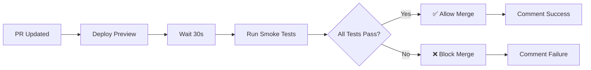

# Preview Environment Smoke Tests

## Overview

Automated smoke tests run on every preview deployment to ensure critical functionality works before allowing PR merges. These tests act as a quality gate, preventing broken code from reaching production.

## What Gets Tested

### 1. Preview Environment Loads Successfully
- Verifies the preview URL is accessible
- Checks for HTTP 200 response
- Ensures page loads without server errors

### 2. No Critical Console Errors
- Monitors browser console for JavaScript errors
- Filters out non-critical warnings (favicon, WebSocket)
- Fails if critical runtime errors detected

### 3. Authentication Page Accessible
- Navigates to `/auth` route
- Verifies auth-related headings render
- Ensures login/signup flow is accessible

### 4. Main Application Elements Render
- Checks for navigation components
- Verifies main content area exists
- Ensures basic app structure is present

### 5. No Network Errors for Critical Resources
- Monitors all network requests
- Tracks failures for JS, CSS, and API calls
- Ensures critical assets load successfully

## Workflow



## Test Results

### Where to Find Results

1. **PR Comments**: Automated comment shows pass/fail status
2. **PR Checks**: Status check appears in "Checks" tab
3. **Actions Tab**: Full workflow logs and artifacts
4. **Workflow Artifacts**: Detailed Playwright reports

### Understanding Test Output

**Success Example:**
```
✅ Smoke Tests Passed

All critical functionality checks passed on the preview environment!

Tests Run:
- ✅ Preview environment loads
- ✅ No critical console errors
- ✅ Authentication page accessible
- ✅ Main application renders
- ✅ No network errors for critical resources

Preview URL: https://[username].github.io/[repo]/preview/pr-123/
```

**Failure Example:**
```
❌ Smoke Tests Failed

Some critical functionality checks failed on the preview environment.

Action Required: Please review and fix the issues before merging this PR.

Preview URL: https://[username].github.io/[repo]/preview/pr-123/

View Details: [workflow run link]
```

## Running Tests Locally

### Prerequisites
```bash
npm ci
npx playwright install chromium
```

### Run Against Preview
```bash
# Set preview URL
export PREVIEW_URL="https://[username].github.io/[repo]/preview/pr-[number]/"

# Run smoke tests
npx playwright test smoke-test.spec.ts

# Run with UI
npx playwright test smoke-test.spec.ts --ui

# Run in debug mode
npx playwright test smoke-test.spec.ts --debug

# View report
npx playwright show-report
```

### Run Against Local Development
```bash
# Start dev server
npm run dev

# In another terminal
export PREVIEW_URL="http://localhost:5173"
npx playwright test smoke-test.spec.ts
```

## Troubleshooting

### Common Failures

#### Test: "preview environment loads successfully"

**Common Causes:**
- Preview not fully deployed yet
- GitHub Pages CDN cache delay
- Build artifacts not uploaded correctly

**Solutions:**
1. Wait 2-3 minutes for GitHub Pages to update
2. Check preview deployment workflow succeeded
3. Verify build step completed successfully
4. Try accessing preview URL manually in browser

#### Test: "no critical console errors"

**Common Causes:**
- JavaScript syntax errors
- Undefined variables or functions
- Failed imports or missing modules
- React rendering errors

**Solutions:**
1. Check browser console in preview environment
2. Review recent code changes for errors
3. Verify all imports are correct
4. Run `npm run build` locally to catch build-time errors

#### Test: "authentication page is accessible"

**Common Causes:**
- Route configuration broken
- Auth component not rendering
- Missing or incorrect route path
- Component import errors

**Solutions:**
1. Verify `/auth` route exists in routing config
2. Check auth component renders correctly
3. Test route navigation locally
4. Review recent routing changes

#### Test: "main application elements render"

**Common Causes:**
- Component rendering failures
- Missing dependencies
- CSS/styling issues hiding elements
- Conditional rendering logic errors

**Solutions:**
1. Check if navigation/main elements exist in HTML
2. Review component logic and conditionals
3. Verify all dependencies installed
4. Test locally with same build configuration

#### Test: "no network errors for critical resources"

**Common Causes:**
- API endpoint errors
- Missing static assets
- CORS issues
- Incorrect API URL configuration

**Solutions:**
1. Check network tab for failed requests
2. Verify API endpoints are accessible
3. Check CORS configuration if API calls fail
4. Review environment variable configuration

### False Positives

If tests fail but preview works correctly:

1. **Timing Issues**: Preview may need more time to stabilize
   - Solution: Wait and re-run tests

2. **Overly Strict Checks**: Test criteria too rigid
   - Solution: Adjust test expectations in workflow file

3. **Environment Differences**: Preview vs. production configuration
   - Solution: Review environment-specific settings

## Extending Smoke Tests

### Adding New Tests

Edit `.github/workflows/preview-smoke-tests.yml` to add tests:

```typescript
test('new functionality works', async ({ page }) => {
  await page.goto(PREVIEW_URL);
  
  // Your test logic here
  await expect(page.locator('selector')).toBeVisible();
});
```

### Best Practices for Smoke Tests

1. **Keep Tests Fast**: Smoke tests should run in < 2 minutes
2. **Focus on Critical Paths**: Test only essential functionality
3. **Be Specific**: Clear error messages help debugging
4. **Handle Async**: Use proper waits and assertions
5. **Test User Flows**: Not just page loads

### Recommended Additional Tests

Consider adding tests for:
- **API Health**: Check API endpoints respond
- **Data Loading**: Verify data fetches work
- **Critical User Flows**: Login, logout, key features
- **Performance**: Page load times within thresholds
- **Accessibility**: Basic a11y checks with axe

## Configuration

### Making Smoke Tests Required

1. Go to repository Settings → Branches
2. Add/edit branch protection rule for `main`
3. Enable "Require status checks to pass before merging"
4. Select "Preview Smoke Tests" as required check

### Adjusting Test Timeout

Edit workflow file to change wait times:

```yaml
- name: Wait for Preview Deployment
  run: |
    echo "Waiting for preview deployment..."
    sleep 60  # Increase from 30 to 60 seconds
```

### Disabling Specific Tests

Comment out tests in the workflow file:

```typescript
// Temporarily disabled - investigating false positives
// test('flaky test', async ({ page }) => {
//   ...
// });
```

## FAQ

**Q: Can I merge without passing smoke tests?**
A: Only repository admins can bypass required checks. This should only be done for critical hotfixes.

**Q: How long do smoke tests take?**
A: Typically 2-4 minutes total (30s wait + 1-2 min tests + reporting).

**Q: What happens if I push a new commit?**
A: Preview redeploys and smoke tests run again automatically.

**Q: Can I run smoke tests before pushing?**
A: Yes! Run them locally against your dev server using the commands above.

**Q: Do smoke tests run on production?**
A: No, these tests only run on preview environments. Production has separate monitoring.

**Q: Can I customize which tests run?**
A: Yes, edit `.github/workflows/preview-smoke-tests.yml` to add/remove tests.

## Related Documentation

- [CI/CD Pipeline](./CI-CD.md) - Complete CI/CD documentation
- [Testing Guide](./TESTING.md) - Comprehensive testing documentation
- [Contributing Guide](../README.md) - How to contribute to the project

## Support

If you encounter issues with smoke tests:

1. Check this documentation first
2. Review workflow logs in Actions tab
3. Download and examine test artifacts
4. Ask in PR comments for help
5. Contact repository maintainers
